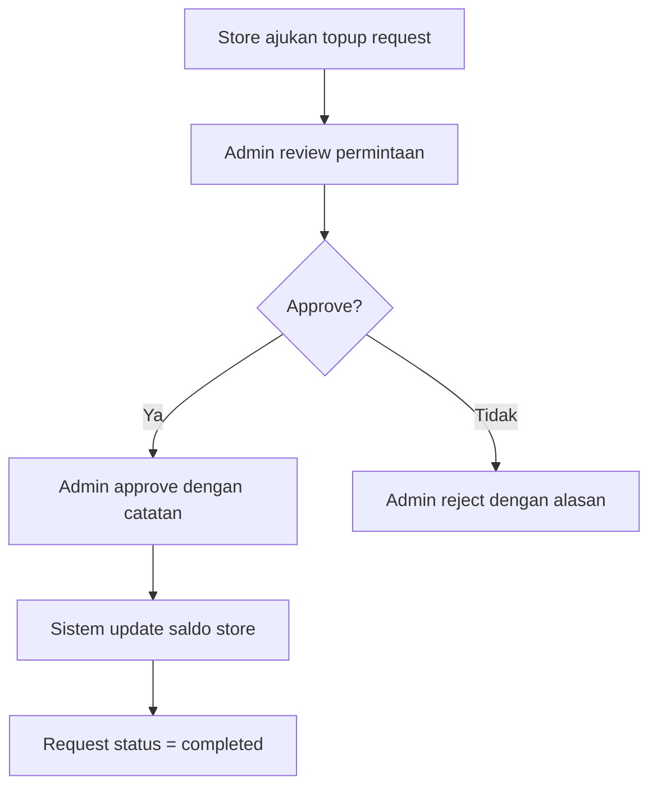
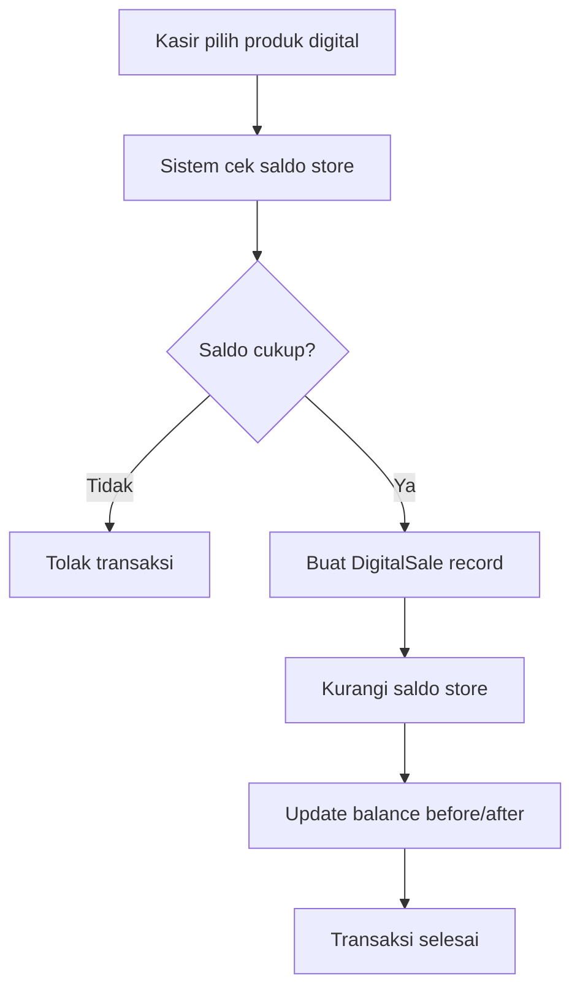
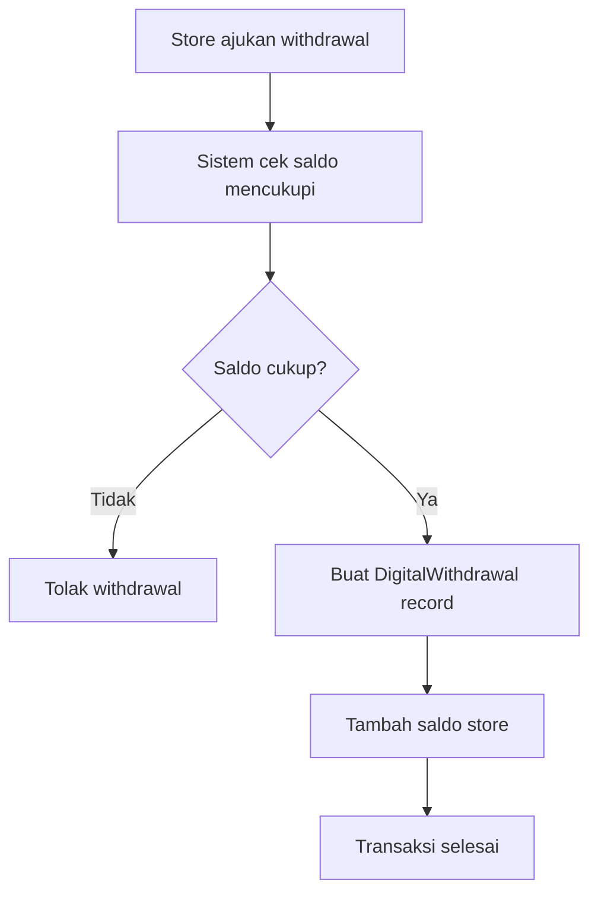

# Dokumentasi Fitur Produk Digital - POS.ezakses

## Overview

Fitur produk digital pada sistem POS.ezakses memungkinkan pengelolaan penjualan produk digital seperti pulsa, paket data, voucher, token listrik, dan voucher game. Sistem ini terintegrasi dengan berbagai provider eksternal dan menyediakan mekanisme topup saldo serta withdrawal yang aman.

## Arsitektur Sistem

### Struktur Database

#### 1. Tabel `digital_providers`
Menyimpan informasi provider layanan digital.

| Field | Type | Description |
|-------|------|-------------|
| id | bigint | Primary key |
| name | varchar(255) | Nama provider |
| code | varchar(100) | Kode unik provider |
| description | text | Deskripsi provider |
| logo | varchar(255) | URL logo provider |
| is_active | boolean | Status aktif/tidak aktif |
| settings | json | Konfigurasi tambahan |

#### 2. Tabel `digital_products`
Menyimpan katalog produk digital yang dijual.

| Field | Type | Description |
|-------|------|-------------|
| id | bigint | Primary key |
| tenant_id | bigint | ID tenant (multi-tenant) |
| name | varchar(255) | Nama produk |
| code | varchar(100) | Kode produk internal |
| product_code | varchar(100) | Kode produk di provider |
| description | text | Deskripsi produk |
| category | varchar(100) | Kategori produk |
| cost_price | decimal(15,2) | Harga beli dari provider |
| sell_price | decimal(15,2) | Harga jual ke customer |
| margin | decimal(15,2) | Keuntungan (auto-calculated) |
| provider_code | varchar(100) | Kode di provider eksternal |
| product_data | json | Data tambahan produk |
| is_active | boolean | Status aktif |
| sort_order | integer | Urutan tampilan |

#### 3. Tabel `store_digital_providers`
Konfigurasi provider untuk setiap store/toko.

| Field | Type | Description |
|-------|------|-------------|
| id | bigint | Primary key |
| tenant_id | bigint | ID tenant |
| store_id | bigint | ID store/toko |
| digital_provider_id | bigint | ID provider |
| balance | decimal(15,2) | Saldo saat ini |
| is_active | boolean | Status aktif |
| settings | json | Konfigurasi khusus store |
| last_topup_at | datetime | Waktu topup terakhir |
| last_topup_amount | decimal(15,2) | Jumlah topup terakhir |

#### 4. Tabel `digital_sales`
Rekam jejak penjualan produk digital.

| Field | Type | Description |
|-------|------|-------------|
| id | bigint | Primary key |
| tenant_id | bigint | ID tenant |
| reference_code | varchar(50) | Kode referensi transaksi |
| date | date | Tanggal transaksi |
| store_id | bigint | ID store |
| digital_provider_id | bigint | ID provider |
| digital_product_id | bigint | ID produk |
| user_id | bigint | ID kasir yang melayani |
| customer_name | varchar(255) | Nama customer |
| customer_phone | varchar(20) | No HP customer |
| cost_price | decimal(15,2) | Harga beli |
| sell_price | decimal(15,2) | Harga jual |
| margin | decimal(15,2) | Keuntungan |
| provider_balance_before | decimal(15,2) | Saldo sebelum transaksi |
| provider_balance_after | decimal(15,2) | Saldo setelah transaksi |
| provider_transaction_id | varchar(255) | ID transaksi di provider |
| customer_transaction_id | varchar(255) | ID transaksi customer |
| status | enum | Status transaksi |
| notes | text | Catatan tambahan |
| transaction_data | json | Data transaksi lengkap |
| completed_at | datetime | Waktu selesai |

#### 5. Tabel `digital_topup_requests`
Permintaan topup saldo dari store ke admin.

| Field | Type | Description |
|-------|------|-------------|
| id | bigint | Primary key |
| tenant_id | bigint | ID tenant |
| request_code | varchar(50) | Kode permintaan |
| store_id | bigint | ID store |
| digital_provider_id | bigint | ID provider |
| requested_by | bigint | ID user yang meminta |
| approved_by | bigint | ID admin yang approve |
| amount | decimal(15,2) | Jumlah topup |
| current_balance | decimal(15,2) | Saldo sebelum topup |
| balance_after_topup | decimal(15,2) | Saldo setelah topup |
| status | enum | Status permintaan |
| reason | text | Alasan topup |
| admin_notes | text | Catatan admin |
| payment_reference | varchar(255) | Referensi pembayaran |
| approved_at | datetime | Waktu approval |
| completed_at | datetime | Waktu completion |
| metadata | json | Data tambahan |

#### 6. Tabel `digital_withdrawals`
Permintaan penarikan saldo dari store.

| Field | Type | Description |
|-------|------|-------------|
| id | bigint | Primary key |
| tenant_id | bigint | ID tenant |
| reference_code | varchar(50) | Kode referensi |
| date | date | Tanggal withdrawal |
| store_id | bigint | ID store |
| digital_provider_id | bigint | ID provider |
| user_id | bigint | ID user yang proses |
| customer_name | varchar(255) | Nama customer |
| customer_phone | varchar(20) | No HP customer |
| withdrawal_amount | decimal(15,2) | Jumlah penarikan |
| admin_fee | decimal(15,2) | Biaya admin |
| total_amount | decimal(15,2) | Total (auto-calculated) |
| provider_balance_before | decimal(15,2) | Saldo sebelum |
| provider_balance_after | decimal(15,2) | Saldo setelah |
| status | enum | Status withdrawal |
| notes | text | Catatan |
| transaction_data | json | Data transaksi |
| completed_at | datetime | Waktu selesai |

## API Endpoints

### Digital Provider Management

#### 1. CRUD Digital Provider
```http
GET    /api/digital-providers              # List semua provider
POST   /api/digital-providers              # Buat provider baru
GET    /api/digital-providers/{id}         # Detail provider
PUT    /api/digital-providers/{id}         # Update provider
DELETE /api/digital-providers/{id}         # Hapus provider
GET    /api/digital-providers/active       # Provider aktif saja
```

#### 2. Store Digital Provider Management
```http
GET    /api/store-digital-providers                    # List konfigurasi store
POST   /api/store-digital-providers                    # Buat konfigurasi baru
GET    /api/store-digital-providers/{id}               # Detail konfigurasi
PUT    /api/store-digital-providers/{id}               # Update konfigurasi
DELETE /api/store-digital-providers/{id}               # Hapus konfigurasi
GET    /api/store-digital-providers/store/{storeId}    # Provider per store
POST   /api/store-digital-providers/{id}/add-balance   # Tambah saldo
GET    /api/store-digital-providers/balance           # Cek saldo
```

### Digital Product Management

#### 1. CRUD Digital Product
```http
GET    /api/digital-products                           # List produk
POST   /api/digital-products                           # Buat produk baru
GET    /api/digital-products/{id}                      # Detail produk
PUT    /api/digital-products/{id}                      # Update produk
DELETE /api/digital-products/{id}                      # Hapus produk
GET    /api/digital-products/category/{category}       # Produk by kategori
GET    /api/digital-products/active                    # Produk aktif saja
```

**Request Body (Create/Update):**
```json
{
  "name": "Pulsa 10.000",
  "code": "PULSA_10K",
  "product_code": "PULSA10K",
  "category": "pulsa",
  "cost_price": 9500,
  "sell_price": 10000,
  "provider_code": "P10K",
  "description": "Pulsa nominal 10.000",
  "is_active": true,
  "sort_order": 1
}
```

### Digital Sales Management

#### 1. CRUD Digital Sales
```http
GET    /api/digital-sales                          # List penjualan
POST   /api/digital-sales                          # Buat penjualan baru
GET    /api/digital-sales/{id}                     # Detail penjualan
PUT    /api/digital-sales/{id}                     # Update penjualan
DELETE /api/digital-sales/{id}                     # Hapus penjualan
GET    /api/digital-sales/store/{storeId}          # Penjualan per store
GET    /api/digital-sales/summary                  # Summary penjualan
```

**Request Body (Create Sale):**
```json
{
  "store_id": 1,
  "digital_provider_id": 1,
  "digital_product_id": 1,
  "cost_price": 9500,
  "sell_price": 10000,
  "customer_name": "John Doe",
  "customer_phone": "08123456789",
  "notes": "Penjualan pulsa"
}
```

### Topup Request Management

#### 1. CRUD Topup Requests
```http
GET    /api/digital-topup-requests                 # List permintaan
POST   /api/digital-topup-requests                 # Buat permintaan baru
GET    /api/digital-topup-requests/{id}            # Detail permintaan
POST   /api/digital-topup-requests/{id}/approve    # Approve permintaan
POST   /api/digital-topup-requests/{id}/reject     # Reject permintaan
POST   /api/digital-topup-requests/{id}/complete   # Complete permintaan
GET    /api/digital-topup-requests/pending         # Permintaan pending
```

**Request Body (Create Topup):**
```json
{
  "store_id": 1,
  "digital_provider_id": 1,
  "amount": 100000,
  "reason": "Topup untuk penjualan minggu ini"
}
```

### Digital Withdrawal Management

#### 1. CRUD Digital Withdrawals
```http
GET    /api/digital-withdrawals                    # List withdrawal
POST   /api/digital-withdrawals                    # Buat withdrawal baru
GET    /api/digital-withdrawals/{id}               # Detail withdrawal
PUT    /api/digital-withdrawals/{id}               # Update withdrawal
DELETE /api/digital-withdrawals/{id}               # Hapus withdrawal
GET    /api/digital-withdrawals/store/{storeId}    # Withdrawal per store
GET    /api/digital-withdrawals/summary            # Summary withdrawal
```

**Request Body (Create Withdrawal):**
```json
{
  "store_id": 1,
  "digital_provider_id": 1,
  "customer_name": "John Doe",
  "customer_phone": "08123456789",
  "withdrawal_amount": 50000,
  "admin_fee": 2500,
  "notes": "Penarikan saldo"
}
```

## Workflow & Business Logic

### 1. Setup Awal

#### Langkah Setup Provider:
1. **Admin** membuat `DigitalProvider` baru
2. **Admin** mengkonfigurasi provider untuk setiap store melalui `StoreDigitalProvider`
3. **Admin** mengisi saldo awal untuk setiap konfigurasi

#### Langkah Setup Produk:
1. **Admin** membuat `DigitalProduct` dengan informasi lengkap
2. **Admin** menentukan harga beli, harga jual, dan kategori
3. **Admin** mengaktifkan produk untuk dapat dijual

### 2. Proses Topup Saldo



**Proses Detail:**
1. Store mengirim `DigitalTopupRequest` dengan jumlah dan alasan
2. Admin review dan approve/reject permintaan
3. Jika diapprove, sistem otomatis menambah saldo di `StoreDigitalProvider`
4. Status request berubah menjadi `completed`

### 3. Proses Penjualan



**Proses Detail:**
1. Kasir memilih produk digital dari katalog
2. Sistem memvalidasi saldo `StoreDigitalProvider` mencukupi
3. Jika saldo cukup, buat record `DigitalSale`
4. Sistem otomatis mengurangi saldo store
5. Record status menjadi `completed`

### 4. Proses Withdrawal



**Catatan:** Withdrawal sebenarnya menambah saldo store karena ini adalah penarikan dari provider eksternal.

## Kategori Produk Digital

Berdasarkan kode frontend, kategori produk yang didukung:

| Kategori | Deskripsi | Contoh Produk |
|----------|-----------|---------------|
| `pulsa` | Pulsa telepon | Pulsa 5.000, Pulsa 10.000 |
| `paket_data` | Paket data internet | Paket 1GB, Paket 5GB |
| `voucher` | Voucher berbagai jenis | Voucher game, Voucher belanja |
| `token` | Token listrik | Token 20kVA, Token 50kVA |
| `game` | Voucher game online | Steam Wallet, Mobile Legends |
| `other` | Kategori lainnya | Produk digital lainnya |

## Permissions & Roles

### Permissions yang Tersedia

#### Digital Provider Management:
- `manage_digital_providers` - Kelola provider digital
- `create_digital_providers` - Buat provider baru
- `view_digital_providers` - Lihat daftar provider
- `edit_digital_providers` - Edit provider
- `delete_digital_providers` - Hapus provider

#### Digital Product Management:
- `manage_digital_products` - Kelola produk digital
- `create_digital_products` - Buat produk baru
- `view_digital_products` - Lihat daftar produk
- `edit_digital_products` - Edit produk
- `delete_digital_products` - Hapus produk

#### Digital Sales:
- `manage_digital_sales` - Kelola penjualan digital
- `create_digital_sales` - Buat penjualan baru
- `view_digital_sales` - Lihat laporan penjualan
- `edit_digital_sales` - Edit penjualan
- `delete_digital_sales` - Hapus penjualan

#### Digital Topup:
- `manage_digital_topup` - Kelola topup saldo
- `create_digital_topup` - Buat permintaan topup
- `approve_digital_topup` - Approve topup request
- `view_digital_topup` - Lihat laporan topup

#### Digital Withdrawal:
- `manage_digital_withdrawal` - Kelola withdrawal
- `create_digital_withdrawal` - Buat withdrawal baru
- `view_digital_withdrawal` - Lihat laporan withdrawal
- `edit_digital_withdrawal` - Edit withdrawal
- `delete_digital_withdrawal` - Hapus withdrawal

### Role Recommendations

#### Super Admin:
- Semua permissions terkait produk digital

#### Admin Store:
- `manage_digital_products` (view only untuk produk sendiri)
- `manage_digital_sales`
- `create_digital_topup`
- `view_digital_topup`
- `manage_digital_withdrawal`

#### Kasir:
- `manage_digital_sales` (hanya create dan view)
- `view_digital_products`

#### Finance/Admin:
- `approve_digital_topup`
- `view_digital_topup`
- `view_digital_sales`
- `view_digital_withdrawal`

## Frontend Components

### 1. DigitalProductForm.js
Form untuk membuat dan mengedit produk digital dengan fitur:
- Input nama, kode, dan kategori produk
- Harga beli dan harga jual dengan kalkulasi margin otomatis
- Switch aktif/tidak aktif
- Validasi form dengan Yup
- Responsive design dengan Bootstrap

### 2. CreateDigitalProvider.js
Komponen untuk membuat provider baru dengan:
- Integrasi Redux untuk state management
- Navigation handling dengan React Router
- Loading state management
- Error handling

### 3. DigitalProviderForm.js
Form untuk mengelola provider digital dengan:
- Input nama, kode, dan deskripsi
- Upload logo provider
- Pengaturan aktif/tidak aktif
- Validasi dan error handling

## Validation Rules

### Digital Provider:
```php
[
    'name' => 'required|string|max:255',
    'code' => 'required|string|unique:digital_providers,code',
    'description' => 'nullable|string',
    'logo' => 'nullable|string',
    'is_active' => 'boolean',
]
```

### Digital Product:
```php
[
    'name' => 'required|string|max:255',
    'code' => 'required|string|unique:digital_products,code',
    'product_code' => 'required|string|unique:digital_products,product_code',
    'category' => 'required|string|max:100',
    'cost_price' => 'required|numeric|min:0',
    'sell_price' => 'required|numeric|min:0',
    'provider_code' => 'nullable|string',
    'is_active' => 'boolean',
]
```

### Digital Sale:
```php
[
    'store_id' => 'required|exists:stores,id',
    'digital_provider_id' => 'required|exists:digital_providers,id',
    'digital_product_id' => 'required|exists:digital_products,id',
    'user_id' => 'required|exists:users,id',
    'cost_price' => 'required|numeric|min:0',
    'sell_price' => 'required|numeric|min:0',
    'customer_name' => 'nullable|string|max:255',
    'customer_phone' => 'nullable|string|max:20',
]
```

## Error Handling

### HTTP Status Codes:
- `200` - Success
- `201` - Created successfully
- `400` - Bad request (validation error)
- `404` - Resource not found
- `422` - Unprocessable entity (business logic error)
- `500` - Internal server error

### Error Response Format:
```json
{
    "message": "Error description",
    "errors": {
        "field_name": ["Error message"]
    }
}
```

## Best Practices

### 1. Security
- Selalu validasi permission sebelum eksekusi
- Gunakan database transaction untuk operasi kritis
- Sanitasi input data
- Log semua aktivitas penting

### 2. Performance
- Gunakan eager loading untuk relationship
- Implementasi caching untuk data yang sering diakses
- Optimasi query dengan index yang tepat
- Pagination untuk list data besar

### 3. Data Integrity
- Auto-calculate margin pada setiap perubahan harga
- Generate unique reference codes
- Track balance before/after untuk audit trail
- Validasi saldo sebelum transaksi

### 4. User Experience
- Real-time balance checking
- Auto-complete untuk produk dan provider
- Clear error messages
- Loading states untuk semua operasi

## Troubleshooting

### Masalah Umum:

#### 1. Saldo Tidak Cukup
- Pastikan store sudah memiliki konfigurasi provider
- Cek saldo di tabel `store_digital_providers`
- Pastikan topup request sudah diapprove dan dicomplete

#### 2. Produk Tidak Muncul
- Cek status `is_active` produk
- Pastikan produk sudah dikategorikan dengan benar
- Cek permission user untuk melihat produk

#### 3. Transaksi Gagal
- Cek log error di Laravel logs
- Pastikan database connection normal
- Cek validation rules yang mungkin berubah

## Kesimpulan

Fitur produk digital pada POS.ezakses menyediakan solusi lengkap untuk pengelolaan penjualan produk digital dengan sistem saldo terpusat, workflow approval yang aman, dan integrasi dengan berbagai provider eksternal. Sistem ini dirancang dengan arsitektur yang scalable dan maintainable untuk mendukung pertumbuhan bisnis.

---

*Dokumen ini dibuat secara otomatis berdasarkan analisis kode pada sistem POS.ezakses tanggal 10 Oktober 2025.*